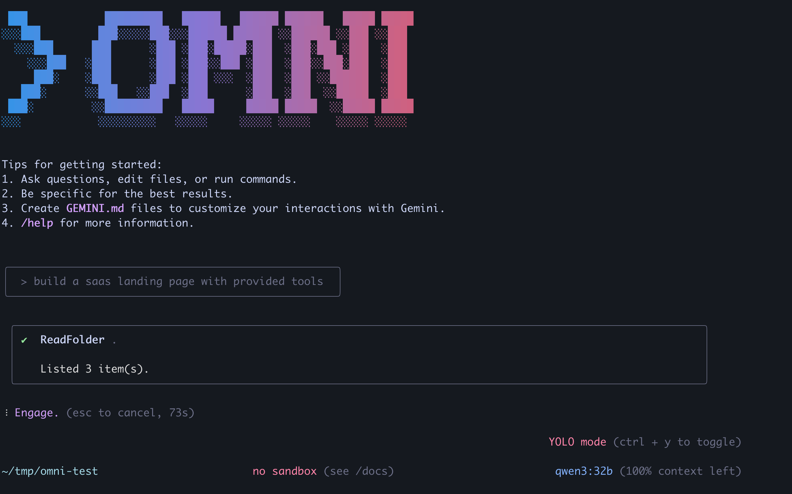

# Omni CLI



Omni CLI is a fork of [Gemini CLI](https://github.com/google-gemini/gemini-cli) that works with almost any LLM providers other than Gemini. Right now, it supports OpenAI, Anthropic, DeepSeek, OpenRouter, Ollama, and vLLM, and we plan to add other popular providers as well.

To install and run, use:

```bash
npm install -g @zhangshushu15/omni-cli
omni --provider ollama --base-url http://localhost:11434 --model qwen3:32b
```

To run with the original Gemini models, simply do:

```bash
omni
```

To see other providers:

```bash
omni --list--providers
```

Please refer to Gemini CLI's documention for its usage. All of Gemini CLI's functions should stay the same.

**Please note** that this is still experimental. The quality may vary significantly between top-tier models and lower-tier ones.
